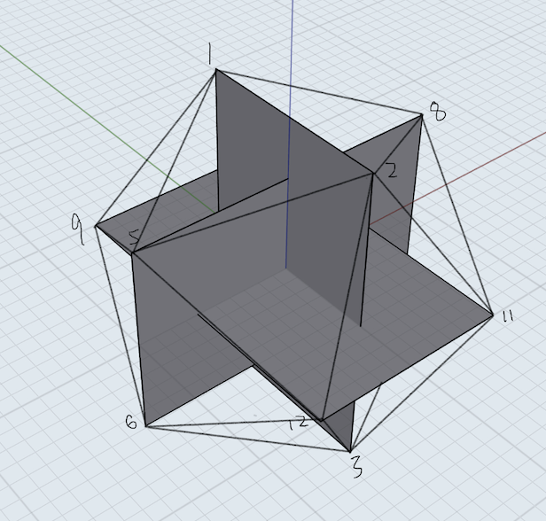

# 毕业论文
# 基于OpenGL ES的虚拟图形系统设计与搭建

关键词：OpenGLES，安卓，游戏引擎

## 0 引言
- 	随着计算机建模技术的发展，市面上
## 1.OpenGL ES简介	
- OpenGL ES是基于OpenGL三维图形的API子集，主要是针对手机以及PDA(掌上电脑)等嵌入式设备设计的。OpenGL ES 的 API由 [Khronos](图形软硬件行业协会) 组织定义并且推广。
- 与其他图形系统不同的是，Open GL ES在Android、IOS两个手机操作系统上都有良好的发展。随着智能手机的普及, Open GL ES的应用范围得以大范围扩展, 其也得以蓬勃发展。
- 用户界面、视频游戏等都依赖于Open GL去驱动显示硬件来加速渲染, 探究其后的原理、机制和技术, 对于深入把握计算机图形学理论、理解游戏引擎、优化程序设计等都具有重要的现实意义。Open GL ES即使是作为Open GL的裁剪版本, 仍然是庞大的, 把握其中的关键点尤为重要。
- 采用OpenGLES在Android上搭建图形系统需要Java作为宿主程序，顶点/法向量的计算都需要宿主程序在cpu中事先计算好存入内存，然后传入渲染管线交给GPU渲染，本系统通过AndroidStudio来搭建安卓程序，并通过Java来简介调用OpenGLES的原生图形API。

## 2.Android平台下模型系统的搭建
### 2.1图形模型
3维模型通常是由各种点，线，面绘制而成，在搭建图形系统初期，我们首先需要通过程序计算或者手算出图形各个顶点将要出现在三维空间坐标系中的位置，并传入让渲染器知会。下面我们将以一个几何球体为例来演示其搭建过程
#### 2.1.1基础模型的绘制
##### 2.1.1.1顶点绘制
- 几何解释
将几何球体的所有顶点绘制出来效果图如下：

几何球体是由正二十面体演化而来，正二十面体一共是由于20个大小相等的正三角形面构成，而其骨架是三个黄金比例(1：0.618)长方形，下面是一个正二十面体

正二十面体有12个顶点，每个顶点都是其中一个长方形的一个顶点。然后将所有的顶点连接起来。由于我们希望能够更加的拟合球面，所以对每个面需要更加细化切分成多个更小的三角形。
如图: [三角形的切分图]

- 代码实现


1. 20面体顶点计算，加入到`ArrayList`中

```java
private void initAlVertix20(ArrayList<Float> alVertix20, float aHalf, float bHalf){
	alVertix20.add(0f); alVertix20.add(aHalf); alVertix20.add(-bHalf);
	alVertix20.add(0f); alVertix20.add(aHalf); alVertix20.add(bHalf);
	alVertix20.add(aHalf); alVertix20.add(bHalf); alVertix20.add(0f);
	alVertix20.add(bHalf); alVertix20.add(0f); alVertix20.add(-aHalf);
	......
}
```
2. 


##### 2.1.1.2 面的绘制


### 2.2光照实现

### 2.3.贴图绘制

### 2.4.摄像机控制


## 3.结束语

